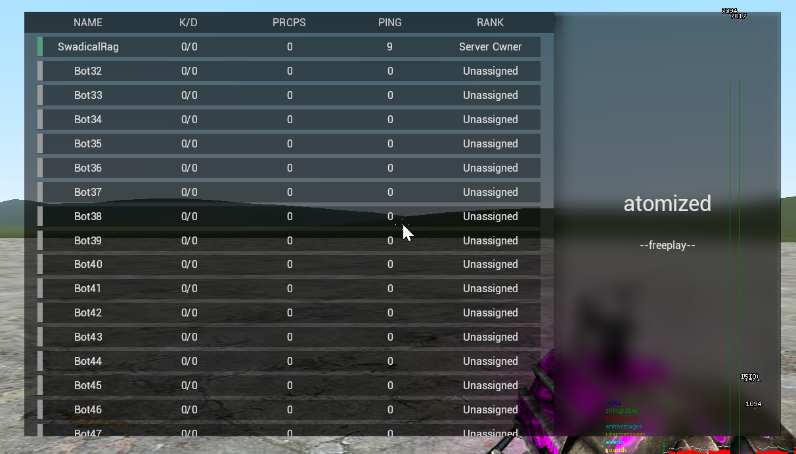
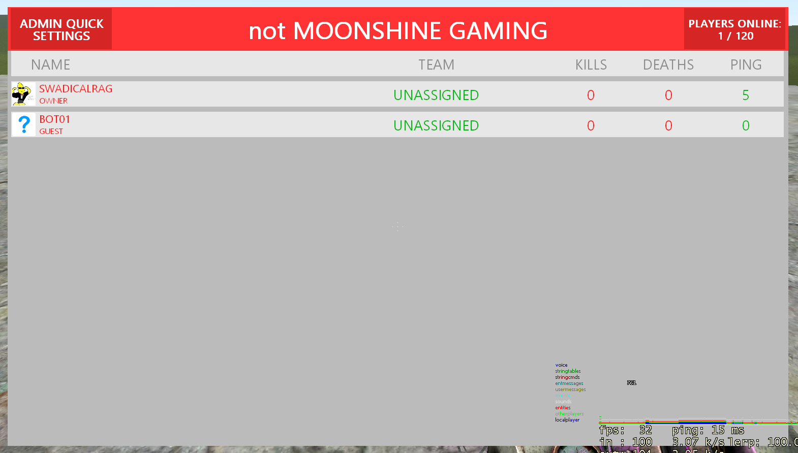

# Here lies mUI
markup User Interface (for Garry's Mod)

2016 - 2016

*R.I.P*

## What was it?

mUI was my attempt at bringing an XML based UI framework to Garry's Mod.
This was made back in a simpler time where I just wanted to simply draw something on screen
without using GMod's included UI libraries, which I found emotionally difficult to use.

Looking back, I am genuinely surprised that I managed to work on this project to get usable results
despite my relative inexperience with real world programming back in 2016.

I am grateful to this project, as I am to everything other project I had the privilege to work on.

## Okay, is there really nothing here for me to see?

Well, for coming all this way, I can give you some eye candy of what I managed to do with this library!

### `2016-01-07_21-22-43.png` A scoreboard that I worked on for an old community I volunteered for


```xml
<TrapCursor />

<Box blur="5" left="20%" top="20%" w="60%" h="60%" color="rgba(0,0,0,150/250)">
    <Box left="0px" top="0px" w="70%" h="100%" color="rgba(0,0,0,150/250)" relative="y">
        <Box left="0px" top="0px" w="100%" h="5%" color="rgba(0,0,0,180/250)">
            <Box left="2.5%" top="0px" w="95%" h="100%" color="rgba(0,0,0,0)">
                <Text color="rgba(250,250,250,150/250)" font="Roboto" font-size="3%" top="50%" left="10%" font-vertical-align="center" font-horizontal-align="center">NAME</Text>
                <Text color="rgba(250,250,250,150/250)" font="Roboto" font-size="3%" top="50%" left="30%" font-vertical-align="center" font-horizontal-align="center">K/D</Text>
                <Text color="rgba(250,250,250,150/250)" font="Roboto" font-size="3%" top="50%" left="50%" font-vertical-align="center" font-horizontal-align="center">PROPS</Text>
                <Text color="rgba(250,250,250,150/250)" font="Roboto" font-size="3%" top="50%" left="70%" font-vertical-align="center" font-horizontal-align="center">PING</Text>
                <Text color="rgba(250,250,250,150/250)" font="Roboto" font-size="3%" top="50%" left="90%" font-vertical-align="center" font-horizontal-align="center">RANK</Text>
            </Box>
        </Box>
        <Scroll w="100%" h="95%" left="0px" top="0px" relative="y" dir="y" barColor="rgba(200, 200, 200, 0.54)" bgColor="rgba(50, 50, 50, 0.31)">
            {{#players}}
            <Box left="2.5%" top="1%" w="95%" h="5%" color="rgba(0,0,0,150/255)">
                <Box left="0px" top="0px" w="1%" h="100%" color="rgba({{color.r}},{{color.g}},{{color.b}}, 75/250)"></Box>
                <Text color="rgba(250,250,250,200/250)" font="Roboto" font-size="3%" top="50%" left="10%" font-vertical-align="center" font-horizontal-align="center">{{name}}</Text>
                <Text color="rgba(250,250,250,200/250)" font="Roboto" font-size="3%" top="50%" left="30%" font-vertical-align="center" font-horizontal-align="center">{{kills}}/{{deaths}}</Text>
                <Text color="rgba(250,250,250,200/250)" font="Roboto" font-size="3%" top="50%" left="50%" font-vertical-align="center" font-horizontal-align="center">{{props}}</Text>
                <Text color="rgba(250,250,250,200/250)" font="Roboto" font-size="3%" top="50%" left="70%" font-vertical-align="center" font-horizontal-align="center">{{ping}}</Text>
                <Text color="rgba(250,250,250,200/250)" font="Roboto" font-size="3%" top="50%" left="90%" font-vertical-align="center" font-horizontal-align="center">{{rank}}</Text>
            </Box>
            {{/players}}
        </Scroll>
    </Box>
    <Box right="0px" top="0px" w="30%" h="100%" color="rgba(0,0,0,150/255)">
        <Text color="rgba(250,250,250,200/250)" font="Roboto" font-size="8%" top="45%" left="50%" font-vertical-align="center" font-horizontal-align="center">atomized</Text>
        <Text color="rgba(250,250,250,200/250)" font="Roboto" font-size="4.25%" top="55%" left="50%" font-vertical-align="center" font-horizontal-align="center">--freeplay--</Text>
    </Box>
</Box>

```

### `2016-01-21_16-54-27.gif` A HUD that I worked on for the same community


```xml
<Box round="3" bottom="10%" left="3%" w="35%" h="15%" color="rgba(225, 225, 225, 0.65)">
    <Text
        font="Segoe UI"
        top="24%"
        left="38%"
        font-size="40px"
        font-weight="1px"
        color="rgb(22, 22, 22)"
        font-vertical-align="center"
        font-horizontal-align="left">{{name}}</Text>
    <Text
        font="Segoe UI"
        top="44%"
        left="40%"
        font-size="32px"
        font-weight="1px"
        color="rgb(22, 22, 22)"
        font-vertical-align="center"
        font-horizontal-align="left">{{team}}</Text>

    <Box round="3" top="57.5%" left="40%" w="55%" h="15%" color="rgba(255, 0, 0, 0.65)" />
    <Box round="3" top="57.5%" left="40%" w="{{healthPerc}}%" h="15%" color="rgba(225, 0, 0, 0.65)" />
</Box>
<Circle cursor="hand" top="82.5%" left="8.5%" radius="6.5%" color="rgb(225, 225, 225)">
    <Portrait left="40%" top="50%" w="75%" h="75%" />
</Circle>

```

### `2016-01-24_01-12-15.png` A scoreboard that I supposedly made in five minutes to prove that scriptfodder scoreboards are easy cashgrabs


